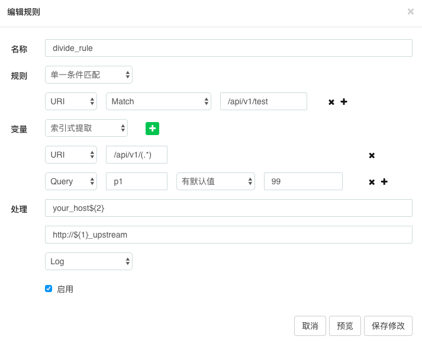

# 深入理解Orange之分流插件


相信在座的都看过`Orange`的`Issues`, 其中问题最多的应该就是分流插件, 本着柿子捡**硬**的捏的原则, 今儿选了这个插件给大家分析分析, 各位看官且听我再唠叨唠叨.


## 试验环境


| host    | url          | port  | method   | mark |
| ------- | ------------ | ----- | -------- | ---- |
| xxx.xxx | /api/v1/test | 12000 | get/post | foo  |
| yyy.yyy | /api/v1/test | 12000 | get/post | bar  |


接口可以附带参数p1,p2, 返回时会打印出来, 如下:

```
curl "http://xxx.xxx:12000/api/v1/test?p1=1&p2=2"

{
    "res": {
        "host": "foo",
        "p1": "1",
        "p2": "2"
    },
    "message": "success",
    "code": 0
}
```


其中foo标记代表是`xxx.xxx`处理的,` yyy.yyy`用bar标记


## 运行分析


以下面的规则来说




如果配置中有脑残的地方, 请忽略, 仅仅只是为了演示.


那就开始分析吧, 让我按下此命令时

```
curl "http://localhost:18888/api/v1/test?p1=1&p2=2"
```


[说的迟那时快](./understanding-orange.md), divide插件唰的进入了access流程

`plugins/divide/handler.lua`

```
function DivideHandler:access(conf)
    local selector = selectors[sid]
    if selector and selector.enable == true then
        local selector_pass 
        if selector.type == 0 then -- 全流量选择器
            selector_pass = true
        else
            selector_pass = judge_util.judge_selector(selector, "divide")-- selector judge
        end
	   selector_pass = judge_util.judge_selector(selector, "divide")
	   
        if selector_pass then
            local stop = filter_rules(sid, "divide", ngx_var, ngx_var_uri, ngx_var_host)
            if stop then -- 不再执行此插件其他逻辑
                return
            en
        end

        if selector.handle and selector.handle.continue == true then
            -- continue next selector
        else
            break
        end
    end
end
```


依然是熟悉的流程. 首先进行`judge_selector`, 因为我们这次的主题不在筛选selector, 所以我们一律全流量了.


直接进入了filter_rules

`plugins/divide/handler.lua`

```
local function filter_rules(sid, plugin, ngx_var, ngx_var_uri, ngx_var_host)
    -- judge阶段
    local pass = judge_util.judge_rule(rule, plugin)

    -- extract阶段
    local variables = extractor_util.extract_variables(rule.extractor)

    -- handle阶段
    if pass then
        local extractor_type = rule.extractor.type
        if rule.upstream_url then
            if not rule.upstream_host or rule.upstream_host=="" then -- host默认取请求的host
                ngx_var.upstream_host = ngx_var_host
            else 
                ngx_var.upstream_host = handle_util.build_upstream_host(extractor_type, rule.upstream_host, variables, plugin)
            end
            ngx_var.upstream_url = handle_util.build_upstream_url(extractor_type, rule.upstream_url, variables, plugin)
        end
        return true
    end
    return false
end
```


代码分为了3个阶段, 让我们一一认识下

- judge
- extract
- handle


**judge阶段**

url显然正确


**extract阶段**

这个东西本质上就是从用户指定的地方读取数据, 然后把数据保存起来, 备用

```
function _M.extract_variables(extractor)
	_M.extract(extractor_type, extractions)
end
```


我们的数据大致如下:

```
["extractor"] = {
    ["extractions"] = {
        [1] = {
            ["name"] = "/api/v1/(.*)",
            ["type"] = "URI",
        },
        [2] = {
            ["name"] = "p1",
            ["default"] = "99",
            ["type"] = "Query",
        },
    },
    ["type"] = 1,
}
```


type解释如下:

- 索引式提取为1
- 模板式提取为2


**模板式提取**

```
function _M.extract(extractor_type, extractions)    
    if not extractor_type then
        extractor_type = 1
    end

    local result = {}
    if extractor_type == 1
        for i, extraction in ipairs(extractions) do
            local variable = extract_variable(extraction) or extraction.default or ""
            table_insert(result, variable)
        end
    elseif extractor_type == 2 then -- tempalte variables extractor
        result = extract_variable_for_template(extractions)
    end
    return result
end
```

如果没有标注怎么提取变量, 那默认测试就是索引提取, 但实际上一切设置都在用Dashboard来操作, 所以基本上不会出现extractor_type不存在的地方.


接着我们就到了下面的代码:

```
local function extract_variable_for_template(extractions)
    local result = {}
    local ngx_var = ngx.var
    for i, extraction in ipairs(extractions) do
        local etype = extraction.type
        if etype == "URI" then -- URI模式通过正则可以提取出N个值
            result["uri"] = {} -- fixbug: nil `uri` variable for tempalte parse
            local uri = ngx_var.uri
            local m, err = ngx_re_match(uri, extraction.name)
            if not err and m and m[1] then
                if not result["uri"] then result["uri"] = {} end
                for j, v in ipairs(m) do
                    if j >= 1 then
                        result["uri"]["v" .. j] = v
                    end
                end
            end
    end
    return result
end
```


这里先分析URI的提取, 逻辑也很简单, 因为extraction.name存放的是正则表达式, 通过match匹配, 把值给匹配出来, 然后依次塞到result["uri"]里, 请注意索引是v1,v2,v3,v4...

> 作者: 注意， 若从URI中提取， 仍然要根据顺序来使用， 如{{uri.v1}}、{{uri.v2}}、{{uri.v3}}.


上面的代码其实有很多的else, 我们再来看一个Query的提取

```
if etype == "Query" then
	local query = ngx.req.get_uri_args()
	if not result["query"] then result["query"] = {} end
	result["query"][extraction.name] = query[extraction.name] or extraction.default
end	
```


代码很简单, 就不分析了, 分析出结果大概如下:

```
variables:{
	["uri"] = {
		["v1"] = "test",
	},
	["query"] = {
		["p1"] = "1",
	},
}
```


顺便我们把索引也看了.


**索引式提取**

```
for i, extraction in ipairs(extractions) do
    local variable = extract_variable(extraction) or extraction.default or ""
    table_insert(result, variable)
end

local function extract_variable(extraction)
    local etype = extraction.type
    local result = ""

    if etype == "URI" then -- 为简化逻辑，URI模式每次只允许提取一个变量
        local uri = ngx.var.uri
        local m, err = ngx_re_match(uri, extraction.name)
        if not err and m and m[1] then
            result = m[1] -- 提取第一个匹配的子模式
        end
    elseif etype == "Query" then
        local query = ngx.req.get_uri_args()
        result = query[extraction.name]
    end
end
```


逻辑跟模板提取几乎没区别, 注意在索引提取时, 所有值是存到 array 里的, 所以只能索引去获取.

> 作者: 索引式提取之后就可以通过`${1}、${2}、${3}`来使用


提出取出来的variables大概如下:

```
variables:{
	[1] = "test",
	[2] = "1",
}
```


现在变量有了, 准备工作也差不多了, 开始看看handler阶段吧.


**handle阶段**

把handle代码总结下, 大概这么个两句:

```
ngx_var.upstream_host = handle_util.build_upstream_host(extractor_type, rule.upstream_host, variables, plugin)

ngx_var.upstream_url = handle_util.build_upstream_url(extractor_type, rule.upstream_url, variables, plugin)
```


先看组成upstream_host

```
function _M.build_upstream_host(extractor_type, upstream_host_tmpl, variables)
    return compose(extractor_type, upstream_host_tmpl, variables)
end
```


委托更底层函数compose来实现

```
local function compose(extractor_type, tmpl, variables)
    if not extractor_type or extractor_type == 1 then
        local result = string_gsub(tmpl, "%${([1-9]+)}", function(m)
            local t = type(variables[tonumber(m)])
            if t ~= "string" and t ~= "number" then
                return "${" .. m .. "}"
            end
            return variables[tonumber(m)]
        end)
        return result
    elseif extractor_type == 2 then
        return template.render(tmpl, variables, ngx_md5(tmpl), true)
    end
end
```


模板式使用[lua-resty-template](https://github.com/bungle/lua-resty-template) 格式化host/url 为我们生成最后的host/url, 具体template的代码我就没往里看了.

索引式更简单, 索引是通过字符串替换的办法将${Number}部分给替换掉.


就这样最后一个阶段也结束了.


最后看一下, 我们到底做了个啥:

我们把/api/v1/test 中的test当做变量提取出来, 用来拼接我们的upstream, 当然这里的test_upstream提前要在nginx中注册, 以后我们如果有别的业务, 例如foobar, 我们也可以利用这个特性,切换到foobar_upstream里面.


- upstream_host = your_host1
- upstream_url = http://test_upstream


**别慌关, 还有**


upstream不像kong那样, 可以动态配置, orange需要在nginx启动前就写好.


测试:

```
$ curl "http://localhost:18888/api/v1/test?p1=1&p2=2"
{"res":{"host":"bar","p1":"1","p2":"2"},"message":"success","code":0}


$ curl -X "POST" "http://localhost:18888/api/v1/test" \
>      -H "Content-Type: application/x-www-form-urlencoded; charset=utf-8" \
>      --data-urlencode "p2=2" \
>      --data-urlencode "p1=1"
{"res":{"host":"foo"},"message":"success","code":0}


$ curl -X "POST" "http://localhost:18888/api/v1/test" \
>      -H "Content-Type: application/json" \
>      -d $'{
>   "p2": "2",
>   "p1": "1"
> }'
{"res":{"host":"bar","p1":"1","p2":"2"},"message":"success","code":0}


```


