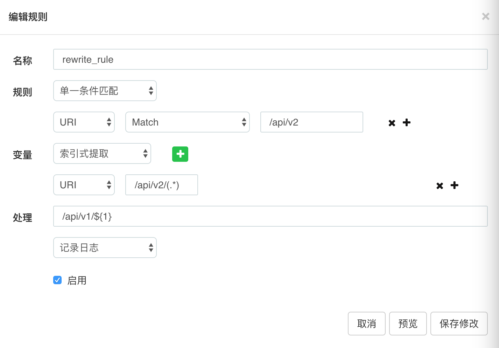
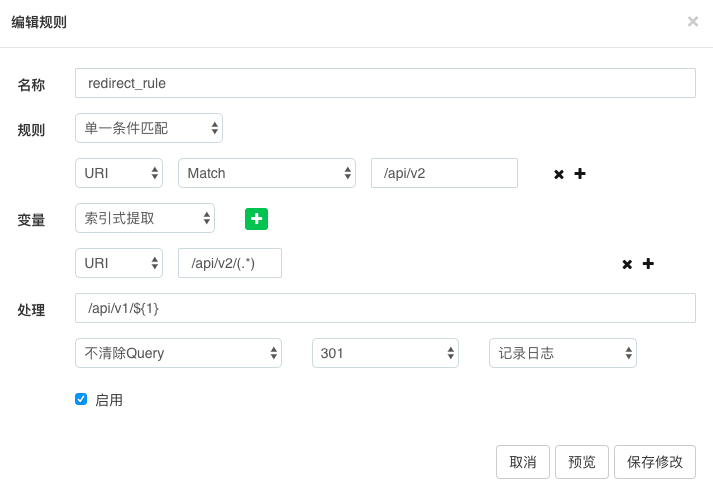
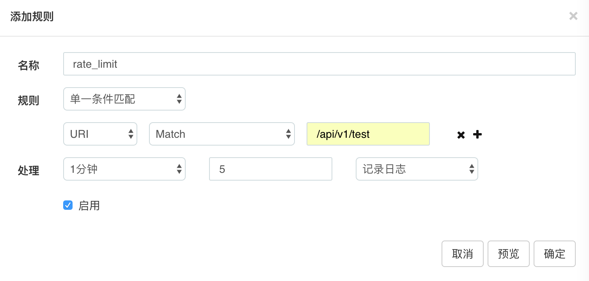

# 深入理解Orange之插件全家桶


[TOC]


相信各位看官都看过我之前写的文章, 其实orange插件大部分代码都类似, 我们有了基础后, 就可以只读一些关键代码了, 下面我们就只讲解最核心的代码.


## rewrite





我们配置的rule如上图, 意图是将v2的请求重写到v1去, 然后脑补orange结构如下(其实是我看db的):

```
rewrite.selector.4157d6e2-18bf-428e-9a47-84079874c98b.rules={
	[1] = {
		["extractor"] = {
			["extractions"] = {
				[1] = {
					["name"] = "/api/v2/(.*)",
					["type"] = "URI",
				},
			},
			["type"] = 1,
		},
		["enable"] = true,
		["id"] = "4b829f20-480b-4acf-9d28-f4d13e81da16",
		["judge"] = {
			["conditions"] = {
				[1] = {
					["value"] = "/api/v2",
					["operator"] = "match",
					["type"] = "URI",
				},
			},
			["type"] = 0,
		},
		["name"] = "rewrite_rule",
		["handle"] = {
			["uri_tmpl"] = "/api/v1/${1}",
			["log"] = true,
		},
		["time"] = "2017-06-15 15:33:56",
	},
}
```


`plugins/rewrite/handler.lua`

```
if handle and handle.uri_tmpl then
    local to_rewrite = handle_util.build_uri(rule.extractor.type, handle.uri_tmpl, variables)
    if to_rewrite and to_rewrite ~= ngx_var_uri then
        local from, to, err = ngx_re_find(to_rewrite, "[%?]{1}", "jo")
        if not err and from and from >= 1 then
            local qs = string_sub(to_rewrite, from+1)
            if qs then
                local args = ngx_decode_args(qs, 0)
                if args then
                    ngx_set_uri_args(args)
                end
            end
        end
        ngx_set_uri(to_rewrite, true)
    end
end
```


想象我们进行如下的请求:

```
curl "http://localhost:18888/api/v2/test?p1=1&p2=2"
```


分析:

第二行代码是生成重写后的地址, 也就是对应本例子中的`/api/v1/test`, 具体生成算法说白了还是`compose`算法, 以variables中的值去替换, variables肯定就是"test"啦.

我们现在已经有了需要重写的地址, 继而就要判断是不是这个地址是不是和之前的一样, 如果一样那还重写个毛, 但如果不是openresty, 仅仅只是nginx的话, nginx好像会重试10次, 最后抛个500, 具体记不清了, 反正nginx是不会让同样的地址进入死循环的.

接着是看重写后的地址, 有没有query parameter, 如果有就把参数提取出来并`ngx.req.set_uri_args`, 我们上述例子是木有的, 你可以自己添加rule试试.

最后一步, 进行重写动作`ngx.req.set_uri`


## redirect




我们配置的rule如上图, 意图是将v2的重定向到v1去

```
redirect.selector.b5461974-163a-4b5b-9305-8d8f07c4ba43.rules={
	[1] = {
		["extractor"] = {
			["extractions"] = {
				[1] = {
					["name"] = "/api/v2/(.*)",
					["type"] = "URI",
				},
			},
			["type"] = 1,
		},
		["enable"] = true,
		["id"] = "e3a09f97-884d-4063-b137-1683de15e89c",
		["judge"] = {
			["conditions"] = {
				[1] = {
					["value"] = "/api/v2",
					["operator"] = "match",
					["type"] = "URI",
				},
			},
			["type"] = 0,
		},
		["name"] = "redirect_rule",
		["handle"] = {
			["redirect_status"] = "301",
			["url_tmpl"] = "/api/v1/${1}",
			["log"] = true,
			["trim_qs"] = false,
		},
		["time"] = "2017-06-16 06:26:11",
	},
}
```


`plugins/redirect/handler.lua`

```
local function filter_rules(sid, plugin, ngx_var_uri, ngx_var_host, ngx_var_scheme, ngx_var_args)
    local handle = rule.handle
    if handle and handle.url_tmpl then
        local to_redirect = handle_util.build_url(rule.extractor.type, handle.url_tmpl, variables)
        if to_redirect and to_redirect ~= ngx_var_uri then
            local redirect_status = tonumber(handle.redirect_status)
            if redirect_status ~= 301 and redirect_status ~= 302 then
                redirect_status = 301
            end

            if string_find(to_redirect, 'http') ~= 1 then
                to_redirect = ngx_var_scheme .. "://" .. ngx_var_host .. to_redirect
            end

            if ngx_var_args ~= nil then
                if string_find(to_redirect, '?') then -- 不存在?，直接缀上url args
                    if handle.trim_qs ~= true then
                        to_redirect = to_redirect .. "&" .. ngx_var_args
                    end
                else
                    if handle.trim_qs ~= true then
                        to_redirect = to_redirect .. "?" .. ngx_var_args
                    end
                end
            end
            ngx_redirect(to_redirect, redirect_status)
        end
    end
end
```


想象我们进行如下的请求:

```
curl "http://localhost:18888/api/v2/test?p1=1&p2=2"
```


分析:

首先拼接字符串, 根据规则生成了/api/v1/test, 然后还是老规矩, 既然跳转就不能和之前重定向的url一致, 顺便检查了用户有没有设置跳转的http status, 如果没有或者不合法, 就默认设定为301, 接着对重定向地址继续检查, 如果发现这不是一个完整url,将其补全, 比如`/api/v1/test` 变成 `http://localhost:18888/api/v1/test`, 最后再对参数进行检查, 根据trim_qs标志, 进行query string的附带

最后, 产生一个301/302的重定向.就完事了.


## waf


防火墙的配置如下:

```
waf.selector.685e689c-c537-425b-af88-7c3310f55e1d.rules={
	[1] = {
		["time"] = "2017-06-16 09:38:43",
		["enable"] = true,
		["id"] = "c90de39f-8782-4bb5-8f09-57892fea31b3",
		["judge"] = {
			["conditions"] = {
				[1] = {
					["value"] = "/api/v1/test",
					["operator"] = "match",
					["type"] = "URI",
				},
			},
			["type"] = 0,
		},
		["name"] = "waf_rule",
		["handle"] = {
			["log"] = true,
			["stat"] = true,
			["perform"] = "deny",
			["code"] = 403,
		},
	},
}
```


`plugins/waf/handler.lua`

```
-- judge阶段
local pass = judge_util.judge_rule(rule, plugin)

-- extract阶段
local variables = extractor_util.extract_variables(rule.extractor)

-- handle阶段
if pass then
    local handle = rule.handle
    if handle.stat == true then
        local key = rule.id -- rule.name .. ":" .. rule.id
        stat.count(key, 1)
    end

    if handle.perform == 'allow' then
        if handle.log == true then
            ngx.log(ngx.INFO, "[WAF-Pass-Rule] ", rule.name, " uri:", ngx_var_uri)
        end
    else
        if handle.log == true then
            ngx.log(ngx.INFO, "[WAF-Forbidden-Rule] ", rule.name, " uri:", ngx_var_uri)
        end
        ngx.exit(tonumber(handle.code or 403))
        return true
    end
end
```


条件是否满足就是`pass`变量, 这个条件是通过还是拒绝是根据`handle.perform`变量来指定

这里还有个计数器是根据`handle.stat`来指定是否计数.

没了.


## rate limiting





```
{
  "name": "rate_limit",
  "judge": {
    "type": 0,
    "conditions": [
      {
        "type": "URI",
        "operator": "match",
        "value": "/api/v1/test"
      }
    ]
  },
  "handle": {
    "period": 60,
    "count": 5,
    "log": true
  },
  "enable": true
}
```


`plugins/rate_limiting/handler`

```
if rule.enable == true then
    -- judge阶段
    local pass = judge_util.judge_rule(rule, plugin)

    -- handle阶段
    local handle = rule.handle
    if pass then
        local limit_type = get_limit_type(handle.period)
        if limit_type then
            local current_timetable = utils.current_timetable()
            local time_key = current_timetable[limit_type]
            local limit_key = rule.id .. "#" .. time_key
            local current_stat = get_current_stat(limit_key) or 0

            ngx.header["X-RateLimit-Limit" .. "-" .. limit_type] = handle.count
            if current_stat >= handle.count then
                ngx.header["X-RateLimit-Remaining" .. "-" .. limit_type] = 0
                ngx.exit(429)
                return true
            else
                ngx.header["X-RateLimit-Remaining" .. "-" .. limit_type] = handle.count - current_stat - 1
                incr_stat(limit_key, limit_type)
            end
        end
    end -- end `pass`
end -- end `enable`
```


本例中limit_type等于"Minute", current_timetable大概如下:

```
current_timetable:{
	["Hour"] = "2017-6-17 7",
	["Second"] = "2017-6-17 7:50:56",
	["Minute"] = "2017-6-17 7:50",
	["Day"] = "2017-6-17",
}
```

time_key 对应着当前的关心的时间, limit_key唯一标示计数器, 身下的逻辑就很简单了, 计数器如果超过了用户设置的最大值, 就exit(429), 咦, 这地方作者为毛没有让用户自定义设置, 如果计数器还没到, 使用incr_stat累加


>  注意:  `get_current_stat`, `incr_stat` 计数器相关都是使用lua_shared_dict的rate_limit


贴一个我被限速了的header

```
HTTP/1.1 429 
Server: openresty/1.11.2.3
Date: Sat, 17 Jun 2017 08:17:33 GMT
Content-Length: 0
Connection: close
X-RateLimit-Limit-Minute: 5
X-RateLimit-Remaining-Minute: 0
```


## property rate limiting

```
{
  "name": "property_rule",
  "judge": {},
  "extractor": {
    "type": 1,
    "extractions": [
      {
        "type": "Query",
        "name": "p1"
      },
      {
        "type": "Query",
        "name": "p2"
      },
      {
        "type": "URI",
        "name": "/api/v1/(.*)"
      }
    ]
  },
  "handle": {
    "period": 60,
    "count": 5,
    "log": true
  },
  "enable": true
}
```


这里插件的pass判断是:

```
local real_value = table_concat( extractor_util.extract_variables(rule.extractor),"#")
local pass = (real_value ~= '');
```

例子中`real_value等于1#2#test`, 只要这个字符串不为空那么就可以进行limit运算.


*我觉得这里功能有点偏弱了, 比如我只想让userid等于123的时候, 进行限速, 不为空的判断我觉得可以改善一下, 可以和rate_limiting插件合并为一个插件*


## monitor

```
{
  "name": "monitor_rule",
  "judge": {
    "type": 0,
    "conditions": [
      {
        "type": "URI",
        "operator": "match",
        "value": "/api/v1/test"
      }
    ]
  },
  "handle": {
    "continue": true,
    "log": false
  },
  "enable": true
}
```


核心代码如下:

```
local key_suffix = rule.id
stat.count(key_suffix)
```


```
function _M.count(key_suffix)
    local ngx_var = ngx.var
    safe_count(TOTAL_COUNT .. key_suffix, 1)

    local http_status = tonumber(ngx_var.status)
    if http_status >= 200 and http_status < 300 then
        safe_count(REQUEST_2XX .. key_suffix, 1)
    elseif http_status >= 300 and http_status < 400 then
        safe_count(REQUEST_3XX .. key_suffix, 1)
    elseif http_status >= 400 and http_status < 500 then
        safe_count(REQUEST_4XX .. key_suffix, 1)
    elseif http_status >= 500 and http_status < 600 then
        safe_count(REQUEST_5XX .. key_suffix, 1)
    end

    safe_count(TRAFFIC_READ .. key_suffix, tonumber(ngx_var.request_length))
    safe_count(TRAFFIC_WRITE .. key_suffix, tonumber(ngx_var.bytes_sent))
    safe_count(TOTAL_REQUEST_TIME .. key_suffix, ngx.now() - ngx.req.start_time())
end
```


上述对各种维度进行了统计, 最后在以api的形式交给web显示.


